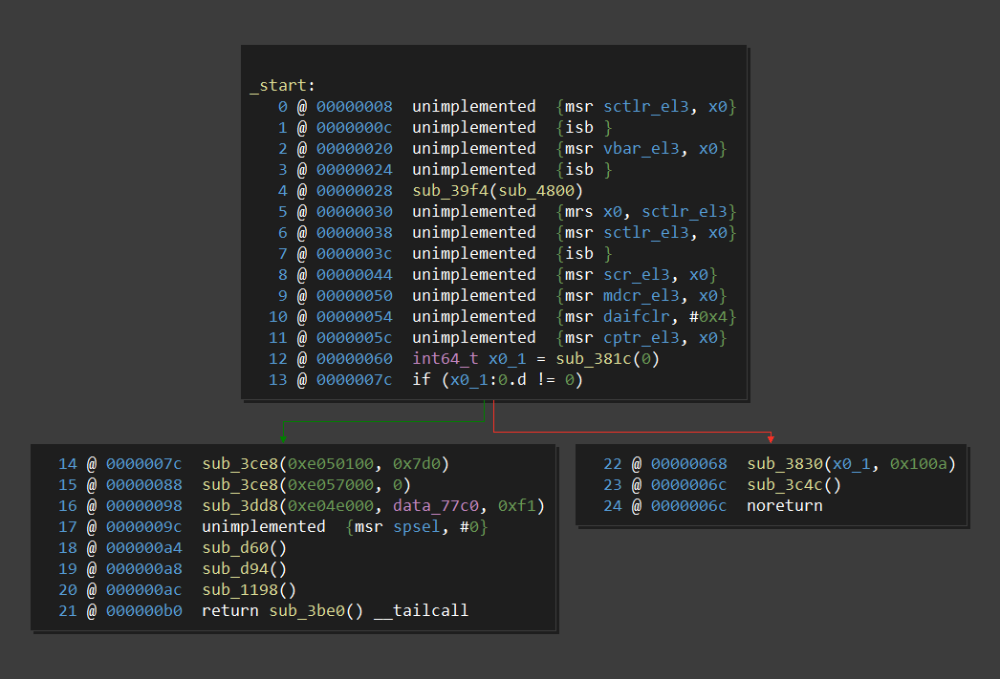
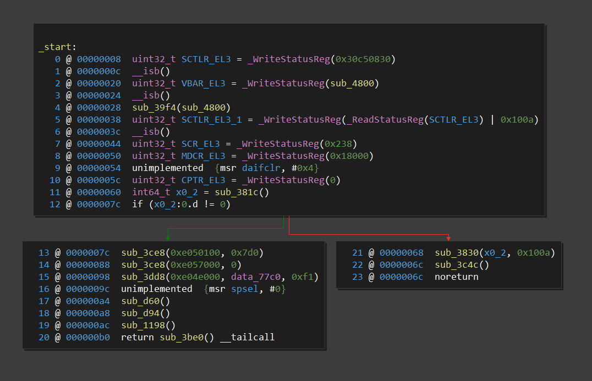

# 2020-10-11 RIP

Thanks to upstream changes in the binja arm64 plugin, this code is now redundant
-- there is a more complete, better maintained, and better tested version in the core
architecture plugin. This plugin does still serve as a good example of an architecture
hook and lifting intrinsics, but no further development will happen here.

If you're interested in lifting additional arm64 instruction, please
[contribute them upstream](https://github.com/Vector35/arch-arm64).

# Arm64Intrinsics for Binja

In Binja's HLIL some useful information can be removed via unlifted
instructions. This adds a lifter for like, five instructions.

### Before


### After


## Help Wanted

- [ ] Add more intrinsics. Note that this plugin is focused soley on
      unlifted instructions that would be lifted as intrinsics if binja lifted
      them, NOT general unlifted instructions
- [ ] Makefile for GNU+Linux and macOS
- [ ] I don't realy know C++, make it more idiomatic

## Build

Requires Binja build >= 2114.

Makefile provided for `nmake` with vs2019. It should be pretty easy to port to
other platforms.

Clone this repo adjacent to `binaryninja-api`, and build `binaryninja-api`.

```
> ls

04/21/2020  06:48 PM    <DIR>          binaryninja-api
04/22/2020  11:36 PM    <DIR>          arm64_intrinsics

> cd arm64_intrinsics
> nmake
```

The makefile assumes Binja is installed in `%LOCALAPPDATA`. If it's installed
elsewhere (e.g. `C:\Program Files`...) update `BINJAPATH`.

## Install

`nmake install`

`nmake uninstall`

## Notes

- `src/msr.h` is autogenerated from from `aarch64.json` using `msr.py`.

## Thanks

@NeatMonster for `aarch64.json` from AMIE.
